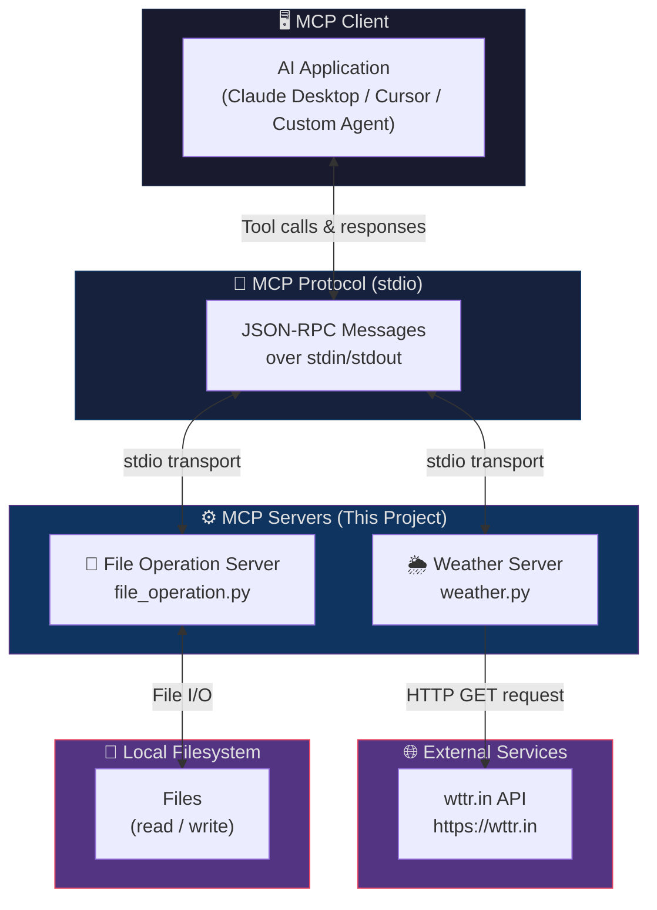
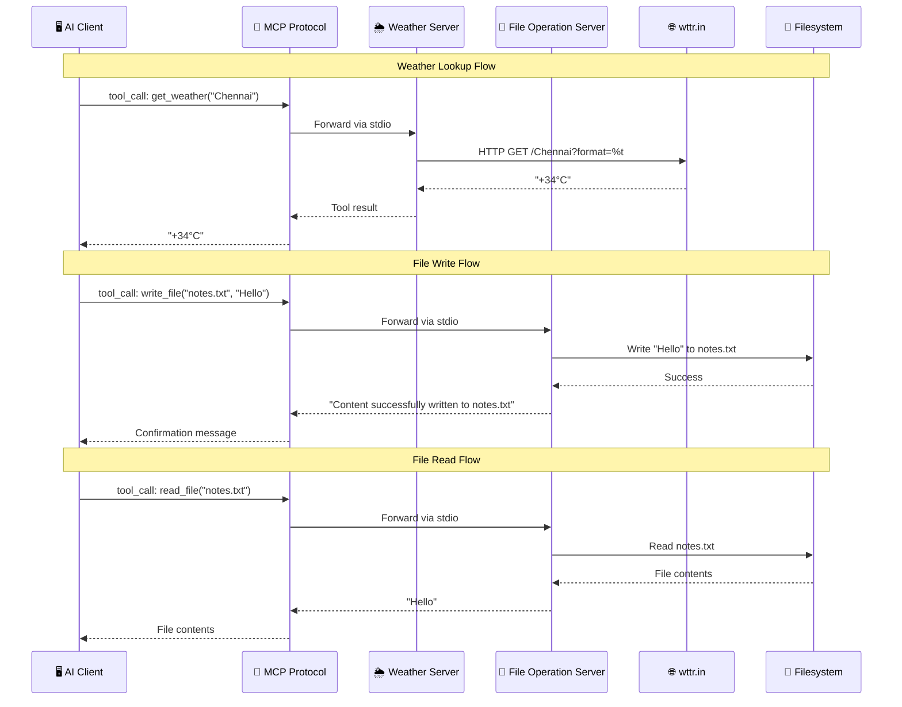
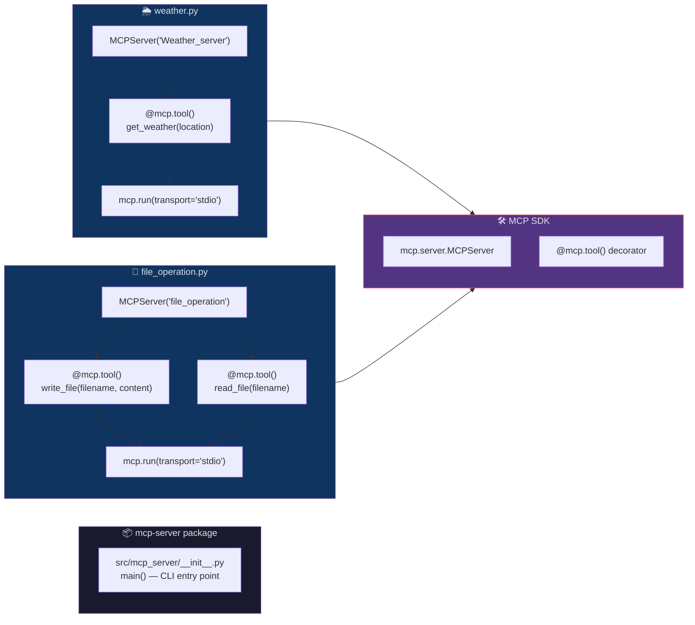

# MCP Server

A Python-based project that implements multiple **Model Context Protocol (MCP)** servers, each exposing a set of tools over the **stdio** transport. These servers can be plugged into any MCP-compatible AI client — such as Claude Desktop, Cursor, or custom LLM agents — to give them real-world capabilities like checking the weather or reading and writing files.

## Table of Contents

- [Architecture](#architecture)
- [How It Works](#how-it-works)
- [Project Structure](#project-structure)
- [Available Servers & Tools](#available-servers--tools)
- [Requirements](#requirements)
- [Installation](#installation)
- [Usage](#usage)
- [Client Configuration](#client-configuration)
- [Dependencies](#dependencies)
- [Author](#author)

## Architecture

### High-Level Overview



### Request Flow



### Component Architecture



## How It Works

1. **AI Client** (e.g., Claude Desktop) spawns an MCP server as a subprocess.
2. Communication happens over **stdio** — the client writes JSON-RPC messages to the server's `stdin` and reads responses from `stdout`.
3. Each server registers its tools using the `@mcp.tool()` decorator from the MCP Python SDK.
4. When the AI decides to use a tool, it sends a `tool_call` request through the protocol.
5. The server executes the tool function, and returns the result back to the client.

## Project Structure

```
MCP_Server/
│
├── weather.py                  # Weather lookup MCP server
├── file_operation.py           # File read/write MCP server
│
├── src/
│   └── mcp_server/
│       └── __init__.py         # Package entry point (CLI: mcp-server)
│
├── Gen_ai.txt                  # Sample file — GenAI explainer for kids
├── Happy.txt                   # Sample file — short text snippet
│
├── pyproject.toml              # Project metadata, dependencies & scripts
├── uv.lock                     # Locked dependency versions
├── .python-version             # Python version constraint (3.13)
└── .gitignore                  # Git ignore rules
```

## Available Servers & Tools

### 1. Weather Server — `weather.py`

Server name: `Weather_server`

Uses the free [wttr.in](https://wttr.in) API to fetch current temperature data.

| Tool | Parameters | Return Value |
|---|---|---|
| `get_weather` | `location` — name of a city or place | Current temperature as text (e.g. `+25°C`) |

**Example interaction:**

```
Tool call: get_weather(location="Chennai")
→ "+34°C"
```

---

### 2. File Operation Server — `file_operation.py`

Server name: `file_operation`

Provides tools to read from and write to files on the local filesystem.

| Tool | Parameters | Return Value |
|---|---|---|
| `write_file` | `filename` (str) — target file path | `"Content successfully written to {filename}"` |
|              | `content` (str) — text to write | |
| `read_file`  | `filename` (str) — file path to read | Full text content of the file |

**Example interaction:**

```
Tool call: write_file(filename="notes.txt", content="Hello World")
→ "Content successfully written to notes.txt"

Tool call: read_file(filename="notes.txt")
→ "Hello World"
```

## Requirements

- **Python** ≥ 3.13
- **[uv](https://docs.astral.sh/uv/)** — recommended package manager for fast installs and lockfile support

## Installation

**1. Clone the repository**

```bash
git clone https://github.com/Vignesh7778/MCP_Server.git
cd MCP_Server
```

**2. Install dependencies with uv**

```bash
uv sync
```

This will create a virtual environment and install all locked dependencies from `uv.lock`.

## Usage

### Running the Weather Server

```bash
uv run python weather.py
```

The server starts and listens for MCP tool calls over stdio.

### Running the File Operation Server

```bash
uv run python file_operation.py
```

### Running the CLI Entry Point

The project also defines a CLI script in `pyproject.toml`:

```bash
uv run mcp-server
```

This runs the `main()` function from `src/mcp_server/__init__.py`.

## Client Configuration

To connect these servers to an MCP-compatible AI client, add them to the client's configuration file.

### Claude Desktop

Add the following to your `claude_desktop_config.json`:

```json
{
  "mcpServers": {
    "weather": {
      "command": "uv",
      "args": ["run", "python", "weather.py"],
      "cwd": "/absolute/path/to/MCP_Server"
    },
    "file_operations": {
      "command": "uv",
      "args": ["run", "python", "file_operation.py"],
      "cwd": "/absolute/path/to/MCP_Server"
    }
  }
}
```

> Replace `/absolute/path/to/MCP_Server` with the actual path where you cloned the repository.

### Cursor

In Cursor's MCP settings, add each server with:

- **Command:** `uv run python weather.py` (or `file_operation.py`)
- **Transport:** `stdio`
- **Working Directory:** path to the cloned repo

## Dependencies

Defined in [`pyproject.toml`](pyproject.toml):

| Package | Version Constraint | Purpose |
|---|---|---|
| `mcp[cli]` | `≥ 2` | MCP Python SDK — provides `MCPServer`, `@mcp.tool()` decorator, and stdio transport |
| `requests` | `≥ 2.34.2` | HTTP client used by the weather server to call the wttr.in API |

**Build system:** `uv_build` (`≥ 0.12.5, < 0.13.0`)

## Author

**Vignesh7778** — [vigneshdevi22@gmail.com](mailto:vigneshdevi22@gmail.com)
